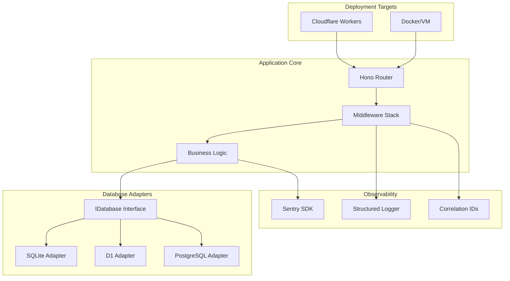

---

name: Extensive Platform Template
overview: Transform hono-lab2 into a production-ready, dual-deployment platform template with database adapters, Sentry integration, HTMX frontend, comprehensive middleware stack, and Docker support for both Cloudflare Workers and VM deployments.
todos:

- id: phase-1-quality
content: Set up code quality foundation (Biome, project structure, scripts)
status: pending
- id: phase-2-core
content: Build core skeleton with middleware stack (logging, correlation, error handling)
status: pending
- id: phase-3-testing
content: Set up testing infrastructure with Vitest and write core tests
status: pending
- id: phase-4-database
content: Implement database adapter pattern with SQLite, D1, and PostgreSQL support
status: pending
- id: phase-5-webhooks
content: Build webhook inbox feature with signature verification
status: pending
- id: phase-6-auth
content: Implement JWT authentication with edge-compatible utilities
status: pending
- id: phase-7-sentry
content: Integrate Sentry with source maps and release tracking
status: pending
- id: phase-8-docker
content: Add Docker support with PostgreSQL and docker-compose
status: pending
- id: phase-9-frontend
content: Build HTMX + Hono JSX frontend for webhook dashboard
status: pending
- id: phase-10-ci
content: Create CI/CD pipelines for both Cloudflare Workers and Docker
status: pending
- id: phase-11-docs
content: Write comprehensive documentation and improve developer experience
status: pending
- id: phase-12-optional
content: Add optional enhancements (OpenAPI, rate limiting, caching, etc.)
status: pending
isProject: false

---

# Extensive Hono Platform Template

This plan transforms the basic Hono starter into a production-ready platform template supporting both Cloudflare Workers and Docker/VM deployments with comprehensive features.

## Architecture Overview



## Phase 1: Code Quality Foundation & Project Structure

**Goal:** Establish code quality tooling, linting, formatting, and TypeScript strict mode.

### Tasks

1. **Choose and configure linter** - Since we need minimal dependencies and edge-friendly setup, use **Biome** (faster than ESLint, single tool for lint+format)
    - Add `@biomejs/biome` as dev dependency
    - Create `biome.json` with strict rules, TypeScript-first config
    - Configure for Cloudflare Workers patterns (no Node.js globals)
2. **Add quality scripts to package.json**
    - `pnpm typecheck` - Run TypeScript compiler with --noEmit
    - `pnpm lint` - Run Biome linter
    - `pnpm format` - Run Biome formatter
    - `pnpm format:check` - Check formatting without writing
    - `pnpm check` - Run all checks (typecheck + lint + format:check)
3. **Create base project structure**
    
    ```
    src/
    ├── index.ts                 # Entry point
    ├── app.ts                   # Hono app factory
    ├── core/
    │   ├── config.ts            # Environment & bindings
    │   ├── types.ts             # Shared types
    │   └── errors.ts            # Custom error classes
    ├── middleware/
    │   ├── index.ts             # Middleware exports
    │   ├── correlation.ts       # Correlation ID middleware
    │   ├── logger.ts            # Request logging middleware
    │   ├── error-handler.ts     # Global error handler
    │   └── security.ts          # Security headers
    ├── lib/
    │   ├── logger/              # Logger implementation
    │   └── db/                  # Database adapters
    ├── routes/
    │   ├── index.ts             # Route registration
    │   └── v1/                  # v1 API routes
    │       └── health.ts        # Health check endpoint
    └── services/                # Business logic layer
    
    ```
    
4. **Remove nodejs_compat flag** from `wrangler.jsonc` - Start clean, add back only if truly needed with justification

**Files created/modified:**

- `biome.json`
- `package.json` (add scripts and @biomejs/biome)
- `src/core/errors.ts`
- `src/core/types.ts`
- `wrangler.jsonc` (remove nodejs_compat)

**Acceptance criteria:**

- `pnpm typecheck` passes with no errors
- `pnpm lint` passes with strict rules
- `pnpm format:check` passes
- Directory structure created

---

## Phase 2: Core Skeleton with Middleware Stack

**Goal:** Build the foundational app structure with middleware for logging, correlation IDs, error handling, and security headers.

### Tasks

1. **Implement correlation ID middleware** ([src/middleware/correlation.ts](https://www.notion.so/src/middleware/correlation.ts))
    - Read `x-correlation-id` from request header or generate UUID
    - Store in Hono context variables
    - Set `x-correlation-id` response header
    - Use Web Crypto API for UUID generation (edge-friendly)
    - Read x-ray-id from cloudflare as a correlation-id fallback
2. **Implement structured logger** ([src/lib/logger/index.ts](https://www.notion.so/src/lib/logger/index.ts))
    - JSON-formatted logs to console
    - Include: timestamp, level, message, correlationId, metadata
    - use pino
    - Support log levels: debug, info, warn, error
    - Environment-based log level control via `LOG_LEVEL` binding
    - Factory function: `createLogger(context)` to inject correlationId
3. **Implement request logging middleware** ([src/middleware/logger.ts](https://www.notion.so/src/middleware/logger.ts))
    - Log incoming request: method, path, correlationId, headers (sanitized)
    - Log outgoing response: status, duration, responseSize
    - Use performance.now() for timing
4. **Implement custom error classes** ([src/core/errors.ts](https://www.notion.so/src/core/errors.ts))
    - `AppError` base class with statusCode, code, details
    - Common errors: `NotFoundError`, `ValidationError`, `UnauthorizedError`, `ForbiddenError`, `ConflictError`
5. **Implement global error handler middleware** ([src/middleware/error-handler.ts](https://www.notion.so/src/middleware/error-handler.ts))
    - Catch all errors in request pipeline
    - Return consistent JSON error responses: `{ error: { code, message, details?, correlationId } }`
    - Log errors with stack traces
    - Handle both AppError and unknown errors
6. **Implement security headers middleware** ([src/middleware/security.ts](https://www.notion.so/src/middleware/security.ts))
    - Set standard security headers: X-Content-Type-Options, X-Frame-Options, X-XSS-Protection
    - Configurable CORS support
7. **Create app factory** ([src/app.ts](https://www.notion.so/src/app.ts))
    - Factory function that creates and configures Hono app
    - Register all middleware in correct order
    - Register routes
    - Add 404 handler (returns NotFoundError)
8. **Create /v1/health endpoint** ([src/routes/v1/health.ts](https://www.notion.so/src/routes/v1/health.ts))
    - Returns: `{ status: "healthy", timestamp: ISO8601, version: "1.0.0", environment: string, database?: { adapter: "sqlite" | "d1" | "postgres", connected: boolean } }`
    - Check database connection if available
    - Report which database adapter is being used (helpful for debugging)
9. **Update entry point** ([src/index.ts](https://www.notion.so/src/index.ts))
    - Import app factory
    - Export app as default
    - Keep it minimal

**Files created/modified:**

- `src/middleware/correlation.ts`
- `src/middleware/logger.ts`
- `src/middleware/error-handler.ts`
- `src/middleware/security.ts`
- `src/middleware/index.ts`
- `src/lib/logger/index.ts`
- `src/core/errors.ts`
- `src/core/types.ts`
- `src/routes/v1/health.ts`
- `src/routes/index.ts`
- `src/app.ts`
- `src/index.ts`

**Acceptance criteria:**

- `pnpm dev` starts successfully
- `curl <http://localhost:8787/v1/health`> returns JSON with status, timestamp, version
- Request/response logs appear in console with correlationId
- `curl <http://localhost:8787/invalid`> returns 404 with consistent JSON error format
- All responses include security headers

---

## Phase 3: Testing Infrastructure

**Goal:** Set up Vitest with Cloudflare Workers test environment and create comprehensive test examples.

### Tasks

1. **Install test dependencies**
    - `vitest` - Test framework
    - `@cloudflare/vitest-pool-workers` - Cloudflare Workers test environment
    - `@cloudflare/workers-types` - Type definitions
2. **Configure Vitest** ([vitest.config.ts](https://www.notion.so/vitest.config.ts))
    - Use `@cloudflare/vitest-pool-workers` pool
    - Configure test environment matching wrangler config
    - Set up coverage with v8 provider
    - Include `src/**/*.test.ts` pattern
3. **Create test utilities** ([src/lib/test-utils.ts](https://www.notion.so/src/lib/test-utils.ts))
    - `createTestContext()` - Mock Hono ExecutionContext
    - `createTestRequest()` - Create Request objects for testing
    - `mockEnv()` - Create mock environment bindings
4. **Write tests**
    - [src/routes/v1/health.test.ts](https://www.notion.so/src/routes/v1/health.test.ts) - Health endpoint tests
    - [src/middleware/correlation.test.ts](https://www.notion.so/src/middleware/correlation.test.ts) - Correlation ID tests
    - [src/middleware/error-handler.test.ts](https://www.notion.so/src/middleware/error-handler.test.ts) - Error handling tests
    - [src/core/errors.test.ts](https://www.notion.so/src/core/errors.test.ts) - Custom error tests
5. **Add test scripts**
    - `pnpm test` - Run all tests
    - `pnpm test:watch` - Watch mode
    - `pnpm test:coverage` - Generate coverage report

**Files created/modified:**

- `vitest.config.ts`
- `package.json` (add vitest dependencies and scripts)
- `src/lib/test-utils.ts`
- `src/routes/v1/health.test.ts`
- `src/middleware/correlation.test.ts`
- `src/middleware/error-handler.test.ts`
- `src/core/errors.test.ts`

**Acceptance criteria:**

- `pnpm test` runs successfully with all tests passing
- Tests use Cloudflare Workers environment
- Coverage report generated showing >80% coverage for core files

---

## Phase 4: Database Adapter Pattern

**Goal:** Implement a clean adapter pattern supporting SQLite (local dev), D1 (Cloudflare Workers production), and PostgreSQL (alternative option) with Drizzle ORM.

### Tasks

1. **Install database dependencies**
    - `drizzle-orm` - ORM
    - `drizzle-kit` - Migrations CLI
    - `better-sqlite3` - SQLite driver (for local development)
    - `@types/better-sqlite3` - TypeScript types for SQLite
    - `postgres` - PostgreSQL driver (optional, for projects using PostgreSQL)
2. **Define database interface** ([src/lib/db/interface.ts](https://www.notion.so/src/lib/db/interface.ts))
    - `IDatabase` interface with methods: `query()`, `insert()`, `update()`, `delete()`, `transaction()`
    - Generic, type-safe interface
    - Not tied to specific database implementation
3. **Create SQLite adapter** ([src/lib/db/adapters/sqlite.ts](https://www.notion.so/src/lib/db/adapters/sqlite.ts))
    - Implements `IDatabase` using better-sqlite3
    - Wraps Drizzle ORM with SQLite driver
    - Uses file path from `env.SQLITE_DB_PATH` or defaults to `./local.db`
    - **For local development only** - provides fast, zero-config database
4. **Create D1 adapter** ([src/lib/db/adapters/d1.ts](https://www.notion.so/src/lib/db/adapters/d1.ts))
    - Implements `IDatabase` using Cloudflare D1 binding
    - Wraps Drizzle ORM with D1 driver
    - Uses `env.DB` binding from Cloudflare Workers
    - **For Cloudflare Workers production** - SQLite-compatible API
5. **Create PostgreSQL adapter** ([src/lib/db/adapters/postgres.ts](https://www.notion.so/src/lib/db/adapters/postgres.ts))
    - Implements `IDatabase` using postgres driver
    - Wraps Drizzle ORM with Postgres driver
    - Reads connection string from `env.DATABASE_URL`
    - **Optional** - for projects that prefer PostgreSQL over D1
6. **Create database factory** ([src/lib/db/index.ts](https://www.notion.so/src/lib/db/index.ts))
    - `createDatabase(env)` factory function with intelligent detection:
        1. If `env.DB` exists (D1 binding) → D1 adapter (Cloudflare Workers production)
        2. Else if `env.DATABASE_URL` exists → PostgreSQL adapter (Docker or explicit PG setup)
        3. Else → SQLite adapter (local development default)
    - Returns appropriate adapter
    - Log which adapter is being used for transparency
7. **Define example schema** ([src/lib/db/schema.ts](https://www.notion.so/src/lib/db/schema.ts))
    - Example table: `webhooks` (id, url, method, headers, body, received_at, processed_at)
    - Use Drizzle schema syntax compatible with **both SQLite (D1) and PostgreSQL**
    - Use universal types: `text`, `integer`, `real` (avoid PG-specific types)
    - Export typed schema
8. **Configure Drizzle migrations**
    - Create `drizzle.config.ts` supporting all three databases
    - Separate migration folders: `migrations/sqlite/`, `migrations/d1/`, `migrations/postgres/`
    - SQLite and D1 share same schema but different migration paths
    - Add migration scripts to package.json:
        - `pnpm db:generate:sqlite` - Generate SQLite migrations
        - `pnpm db:generate:d1` - Generate D1 migrations (same as SQLite)
        - `pnpm db:generate:postgres` - Generate PostgreSQL migrations
        - `pnpm db:migrate:local` - Run SQLite migrations locally
        - `pnpm db:migrate:d1` - Run D1 migrations (via wrangler)
        - `pnpm db:migrate:postgres` - Run PostgreSQL migrations
9. **Update wrangler.jsonc** - Add D1 binding (for production deployment)
    
    ```json
    "d1_databases": [
      {
        "binding": "DB",
        "database_name": "hono-lab2-db",
        "database_id": "xxx" // Generated on first CF deploy
      }
    ]
    
    ```
    
10. **Update Bindings type** ([src/core/config.ts](https://www.notion.so/src/core/config.ts))
    - Add `DB?: D1Database` for Cloudflare D1
    - Add `DATABASE_URL?: string` for PostgreSQL
    - Add `SQLITE_DB_PATH?: string` for SQLite (defaults to `./local.db`)
11. **Create database service layer example** ([src/services/webhooks.ts](https://www.notion.so/src/services/webhooks.ts))
    - `WebhookService` class accepting `IDatabase`
    - CRUD methods: `create()`, `findById()`, `list()`, `markProcessed()`
    - Example of clean service layer using adapter pattern
    - Works identically across SQLite, D1, and PostgreSQL
12. **Add .gitignore entries**
    - Add `.db` and `.db-*` to ignore local SQLite database files

**Files created/modified:**

- `src/lib/db/interface.ts`
- `src/lib/db/adapters/sqlite.ts`
- `src/lib/db/adapters/d1.ts`
- `src/lib/db/adapters/postgres.ts`
- `src/lib/db/index.ts`
- `src/lib/db/schema.ts`
- `src/services/webhooks.ts`
- `drizzle.config.ts`
- `package.json` (add dependencies and migration scripts)
- `wrangler.jsonc` (add D1 binding)
- `src/core/config.ts` (update Bindings type)
- `.gitignore` (add *.db)
- `migrations/sqlite/` (folder)
- `migrations/d1/` (folder)
- `migrations/postgres/` (folder)

**Acceptance criteria:**

- `pnpm dev` uses SQLite by default (no external database required)
- Can generate migrations for all three databases
- Can run migrations: `pnpm db:migrate:local` works with SQLite
- Database factory correctly detects and instantiates appropriate adapter based on environment
- Service layer uses `IDatabase` interface without knowing concrete implementation
- Local SQLite database file (`local.db`) is created automatically and gitignored

---

## Phase 5: Webhook Inbox Feature

**Goal:** Implement webhook receiver endpoints with async processing capability.

### Tasks

1. **Create webhook routes** ([src/routes/v1/webhooks.ts](https://www.notion.so/src/routes/v1/webhooks.ts))
    - `POST /v1/webhooks/receive` - Receive arbitrary webhook
        - Accept any JSON body
        - Store: method, url, headers, body, timestamp
        - Return: `{ id, receivedAt }`
    - `GET /v1/webhooks` - List webhooks with pagination
        - Query params: `?limit=20&offset=0`
        - Return: `{ data: [...], pagination: { limit, offset, total } }`
    - `GET /v1/webhooks/:id` - Get single webhook
        - Return: full webhook details
2. **Implement webhook signature verification example** ([src/lib/webhook-verify.ts](https://www.notion.so/src/lib/webhook-verify.ts))
    - Use Web Crypto API (SubtleCrypto)
    - Example: HMAC-SHA256 signature verification
    - Middleware: `verifyWebhookSignature(secret)` - optional middleware for routes
3. **Add Cloudflare Queue binding** (preparation for Phase 6)
    - Update `wrangler.jsonc` with Queue producer binding
    - Update Bindings type

**Files created/modified:**

- `src/routes/v1/webhooks.ts`
- `src/lib/webhook-verify.ts`
- `wrangler.jsonc` (add Queue binding)
- `src/core/config.ts` (update Bindings)

**Acceptance criteria:**

- `curl -X POST <http://localhost:8787/v1/webhooks/receive> -d '{"test": "data"}' -H "Content-Type: application/json"` stores webhook and returns ID
- `curl <http://localhost:8787/v1/webhooks`> lists webhooks with pagination
- `curl <http://localhost:8787/v1/webhooks/:id`> retrieves specific webhook
- Signature verification middleware works correctly with valid/invalid signatures

---

## Phase 6: JWT Authentication

**Goal:** Implement JWT-based authentication suitable for edge environments.

### Tasks

1. **Install dependencies**
    - `hono/jwt` - Hono's built-in JWT utilities (uses Web Crypto API)
2. **Create auth utilities** ([src/lib/auth/jwt.ts](https://www.notion.so/src/lib/auth/jwt.ts))
    - `generateToken(payload, secret)` - Create JWT
    - `verifyToken(token, secret)` - Verify and decode JWT
    - Use Hono's jwt utilities (edge-compatible)
3. **Create auth middleware** ([src/middleware/auth.ts](https://www.notion.so/src/middleware/auth.ts))
    - `requireAuth()` - Verify JWT from Authorization header
    - Extract user info and add to context
    - Return 401 if missing/invalid token
4. **Create auth routes** ([src/routes/v1/auth.ts](https://www.notion.so/src/routes/v1/auth.ts))
    - `POST /v1/auth/token` - Issue JWT for development/testing
        - Accept: `{ userId, role }`
        - Return: `{ token, expiresIn }`
    - `GET /v1/auth/me` - Get current user (protected route)
5. **Update config** - Add `JWT_SECRET` to Bindings type

**Files created/modified:**

- `src/lib/auth/jwt.ts`
- `src/middleware/auth.ts`
- `src/routes/v1/auth.ts`
- `src/core/config.ts` (add JWT_SECRET to Bindings)
- `wrangler.jsonc` (add JWT_SECRET to vars)

**Acceptance criteria:**

- Can generate token: `curl -X POST <http://localhost:8787/v1/auth/token> -d '{"userId": "test"}'`
- Protected routes reject requests without token (401)
- Protected routes accept requests with valid token
- `curl <http://localhost:8787/v1/auth/me> -H "Authorization: Bearer <token>"` returns user info

---

## Phase 7: Sentry Integration with Source Maps

**Goal:** Integrate Sentry for error tracking with source map support for both Cloudflare Workers and Docker deployments.

### Tasks

1. **Install Sentry dependencies**
    - `@sentry/cloudflare` - Cloudflare Workers SDK
    - `@sentry/node` - Node.js SDK (for Docker)
2. **Create Sentry initialization** ([src/lib/sentry/index.ts](https://www.notion.so/src/lib/sentry/index.ts))
    - Detect environment (Workers vs Node)
    - Initialize appropriate SDK
    - Configure: DSN, environment, release version, sample rate
    - Export `captureException()`, `captureMessage()`, `setUser()`, `setContext()`
3. **Create Sentry middleware** ([src/middleware/sentry.ts](https://www.notion.so/src/middleware/sentry.ts))
    - Initialize Sentry with request context
    - Set user/request context on Sentry scope
    - Wrap error handler to send errors to Sentry
4. **Update error handler** ([src/middleware/error-handler.ts](https://www.notion.so/src/middleware/error-handler.ts))
    - Call `captureException()` for all errors
    - Include correlationId in Sentry context
5. **Configure source maps for Cloudflare Workers**
    - Update `wrangler.jsonc`: enable source maps in build
    - Create script to upload source maps to Sentry
    - Use `@sentry/cli` for uploads
6. **Configure release tracking**
    - Generate release version from git commit or env var
    - Set release in Sentry initialization
    - Script to create Sentry release and upload source maps
7. **Add Sentry configuration to environment**
    - `SENTRY_DSN` - Sentry project DSN
    - `SENTRY_ENVIRONMENT` - Environment name (dev/staging/prod)
    - `SENTRY_RELEASE` - Release version
    - `SENTRY_AUTH_TOKEN` - For uploads (secret)

**Files created/modified:**

- `src/lib/sentry/index.ts`
- `src/middleware/sentry.ts`
- `src/middleware/error-handler.ts` (update)
- `package.json` (add @sentry/* dependencies and scripts)
- `wrangler.jsonc` (add Sentry config vars)
- `src/core/config.ts` (add Sentry vars to Bindings)
- `scripts/upload-sourcemaps.sh`

**Acceptance criteria:**

- Errors automatically sent to Sentry
- Source maps correctly resolve in Sentry (shows TypeScript code, not minified)
- Release tracking shows git commit/version
- Correlation IDs appear in Sentry error context

---

## Phase 8: Docker Support

**Goal:** Add Docker and docker-compose setup for VM deployment with PostgreSQL.

### Tasks

1. **Create Dockerfile** ([Dockerfile](https://www.notion.so/Dockerfile))
    - Multi-stage build: build stage + runtime stage
    - Build stage: install dependencies, build TypeScript
    - Runtime stage: minimal Node.js image, copy build output
    - Use pnpm for dependency management
    - Set environment variables
    - Expose port 8787
    - Health check endpoint
2. **Create docker-compose.yml** ([docker-compose.yml](https://www.notion.so/docker-compose.yml))
    - Service: `app` (Hono application)
    - Service: `postgres` (PostgreSQL 16)
    - Service: `redis` (optional, for caching/rate limiting)
    - Volumes: postgres data persistence
    - Network: app can reach postgres
    - Environment variables properly passed
    - Health checks for all services
3. **Create Docker entrypoint script** ([scripts/docker-entrypoint.sh](https://www.notion.so/scripts/docker-entrypoint.sh))
    - Run database migrations
    - Start application server
4. **Create Node.js server for Docker** ([src/server.ts](https://www.notion.so/src/server.ts))
    - Use `@hono/node-server` adapter
    - Import app from [src/app.ts](https://www.notion.so/src/app.ts)
    - Serve on port 8787
    - Graceful shutdown handling
5. **Create .dockerignore** ([.dockerignore](https://www.notion.so/.dockerignore))
    - Exclude: node_modules, .git, dist, coverage, etc.
6. **Update package.json**
    - Add `start:docker` script: `node dist/server.js`
    - Add `@hono/node-server` dependency
7. **Create environment examples**
    - `.env.example` - Template for environment variables
    - `.env.docker` - Docker-specific defaults
8. **Update tsconfig for dual build**
    - Ensure both Cloudflare Workers entry and Node server entry can be built
    - Create separate tsconfig for server if needed

**Files created/modified:**

- `Dockerfile`
- `docker-compose.yml`
- `.dockerignore`
- `scripts/docker-entrypoint.sh`
- `src/server.ts`
- `.env.example`
- `.env.docker`
- `package.json` (add @hono/node-server)

**Acceptance criteria:**

- `docker-compose up` starts all services successfully
- App accessible at `http://localhost:8787`
- Database migrations run automatically on container start
- PostgreSQL adapter used by default (can be configured to use SQLite)
- Health check passes: `docker-compose ps` shows healthy status
- Can rebuild and restart: `docker-compose down && docker-compose up --build`

---

## Phase 9: HTMX + Hono JSX Frontend

**Goal:** Add server-side rendering with HTMX for interactive frontend.

### Tasks

1. **Create JSX layouts** ([src/views/layouts/base.tsx](https://www.notion.so/src/views/layouts/base.tsx))
    - Base HTML structure with HTMX script
    - Include: meta tags, HTMX CDN, CSS (inline or external)
    - Support for page title and content injection
2. **Create JSX components**
    - [src/views/components/nav.tsx](https://www.notion.so/src/views/components/nav.tsx) - Navigation bar
    - [src/views/components/webhook-list.tsx](https://www.notion.so/src/views/components/webhook-list.tsx) - Webhook list with HTMX pagination
    - [src/views/components/webhook-form.tsx](https://www.notion.so/src/views/components/webhook-form.tsx) - Form to send test webhook
3. **Create page routes** ([src/routes/views/index.ts](https://www.notion.so/src/routes/views/index.ts))
    - `GET /` - Dashboard page (list webhooks, show form)
    - `GET /webhooks` - HTMX partial: webhook list with pagination
    - Use JSX to render HTML responses
    - Set `Content-Type: text/html`
4. **Add basic CSS** ([public/styles.css](https://www.notion.so/public/styles.css))
    - Minimal, modern styles
    - Responsive design
    - Use CSS variables for theming
5. **Update static assets serving**
    - Ensure `public/` directory is served for CSS/JS/images
    - Already configured in wrangler.jsonc with ASSETS binding

**Files created/modified:**

- `src/views/layouts/base.tsx`
- `src/views/components/nav.tsx`
- `src/views/components/webhook-list.tsx`
- `src/views/components/webhook-form.tsx`
- `src/routes/views/index.ts`
- `public/styles.css`
- `src/routes/index.ts` (register view routes)

**Acceptance criteria:**

- Navigate to `http://localhost:8787/` shows dashboard with webhook list
- HTMX pagination works (click "Next" updates list without full page reload)
- Form submission uses HTMX to POST and update UI
- CSS styles applied correctly
- Works in both Cloudflare Workers and Docker modes

---

## Phase 10: CI/CD Pipeline

**Goal:** Set up GitHub Actions for automated testing, linting, and deployment.

### Tasks

1. **Create CI workflow** ([.github/workflows/ci.yml](https://www.notion.so/.github/workflows/ci.yml))
    - Trigger: on push to main, pull requests
    - Jobs:
        - **Lint & Format**: Run Biome checks
        - **Typecheck**: Run TypeScript compiler
        - **Test**: Run Vitest with coverage
        - **Build (Workers)**: Test Wrangler build
        - **Build (Docker)**: Build Docker image
    - Use pnpm caching
    - Run jobs in parallel where possible
    - Upload coverage reports
2. **Create deployment workflow for Cloudflare** ([.github/workflows/deploy-cf.yml](https://www.notion.so/.github/workflows/deploy-cf.yml))
    - Trigger: manual (workflow_dispatch) or tag push
    - Jobs:
        - Build and deploy to Cloudflare Workers
        - Upload source maps to Sentry
        - Create Sentry release
    - Use secrets: `CLOUDFLARE_API_TOKEN`, `SENTRY_AUTH_TOKEN`
3. **Create deployment workflow for Docker** ([.github/workflows/deploy-docker.yml](https://www.notion.so/.github/workflows/deploy-docker.yml))
    - Trigger: manual or tag push
    - Jobs:
        - Build Docker image
        - Push to container registry (Docker Hub or GitHub Container Registry)
        - Tag with version and latest
4. **Add status badges to README**
    - CI status badge
    - Coverage badge (if using Codecov)

**Files created/modified:**

- `.github/workflows/ci.yml`
- `.github/workflows/deploy-cf.yml`
- `.github/workflows/deploy-docker.yml`
- `README.md` (add badges)

**Acceptance criteria:**

- Push to main triggers CI workflow
- All CI jobs pass (lint, typecheck, test, build)
- Manual deploy to Cloudflare Workers works
- Docker image built and pushed successfully
- Source maps uploaded to Sentry on deploy

---

## Phase 11: Documentation & Developer Experience

**Goal:** Comprehensive documentation and developer tooling for easy onboarding.

### Tasks

1. **Update [README.md](http://readme.md/)** - Comprehensive documentation
    - Project overview and features
    - Architecture diagram
    - Prerequisites (Node, pnpm, wrangler, Docker)
    - Quick start guide
    - Development commands
    - Deployment guide (both CF Workers and Docker)
    - Environment variables reference
    - API documentation (endpoints)
    - Testing guide
    - Contribution guidelines
2. **Create [ARCHITECTURE.md](http://architecture.md/)**
    - Detailed architecture explanation
    - Database adapter pattern
    - Middleware stack
    - Deployment targets comparison
    - Directory structure guide
    - Extension points
3. **Create [CONTRIBUTING.md](http://contributing.md/)**
    - How to contribute
    - Code style guidelines
    - Testing requirements
    - PR process
4. **Create [API.md](http://api.md/)** (API documentation)
    - All endpoints documented
    - Request/response examples
    - Error codes reference
    - Authentication guide
5. **Add code comments and JSDoc**
    - Document all public APIs
    - Add JSDoc comments to functions/classes
    - Explain complex logic
6. **Create VS Code workspace settings** ([.vscode/settings.json](https://www.notion.so/.vscode/settings.json))
    - Recommended extensions
    - Biome as default formatter
    - Auto-format on save
    - TypeScript settings
7. **Create VS Code launch configurations** ([.vscode/launch.json](https://www.notion.so/.vscode/launch.json))
    - Debug Cloudflare Worker locally
    - Debug tests
8. **Add pre-commit hooks** (optional)
    - Use `husky` and `lint-staged`
    - Run lint/format on staged files
    - Run typecheck

**Files created/modified:**

- `README.md` (major update)
- `ARCHITECTURE.md`
- `CONTRIBUTING.md`
- `API.md`
- `.vscode/settings.json`
- `.vscode/launch.json`
- `package.json` (optional: add husky, lint-staged)

**Acceptance criteria:**

- New developer can clone repo and get started in <5 minutes
- All endpoints documented with examples
- Architecture clearly explained with diagrams
- VS Code provides great DX with autocomplete and debugging

---

## Phase 12: Optional Enhancements

**Goal:** Additional nice-to-have features to make the template even more powerful.

### Optional Features

1. **OpenAPI/Swagger Documentation**
    - Use `@hono/zod-openapi` for schema validation and OpenAPI export
    - Generate OpenAPI spec from code
    - Serve Swagger UI at `/docs`
2. **Rate Limiting**
    - Implement using Cloudflare Durable Objects (for CF Workers)
    - Implement using Redis (for Docker)
    - Adapter pattern for rate limiting backends
    - Middleware: `rateLimit({ windowMs, maxRequests })`
3. **Caching Layer**
    - Implement using Cloudflare KV (for CF Workers)
    - Implement using Redis (for Docker)
    - Adapter pattern for cache backends
    - Service: `CacheService` with get/set/delete
4. **Background Jobs with Queues**
    - Cloudflare Queues integration (for CF Workers)
    - Bull/BullMQ integration (for Docker with Redis)
    - Webhook async processing example
5. **Metrics & Monitoring**
    - Request metrics (count, duration, status codes)
    - Custom business metrics
    - Export to Prometheus (Docker) or Cloudflare Analytics (Workers)
6. **Email Service Integration**
    - Adapter pattern for email providers
    - Support: Resend (edge-friendly), SendGrid, Mailgun
    - Example: welcome email on user registration
7. **File Upload Handling**
    - Cloudflare R2 integration (for CF Workers)
    - Local filesystem or S3 (for Docker)
    - Signed URL generation
    - Image processing example

**Implementation:** These features are optional and can be added based on specific project needs. Each would follow the same adapter pattern for dual deployment support.

---

## Summary & Key Decisions

### Technology Choices

1. **Linter/Formatter:** Biome (single tool, faster than ESLint+Prettier, minimal config)
2. **Testing:** Vitest with `@cloudflare/vitest-pool-workers` (Workers-compatible test environment)
3. **ORM:** Drizzle (type-safe, edge-friendly, supports SQLite, D1, and PostgreSQL)
4. **Database Adapters:** SQLite for local dev, D1 for Cloudflare Workers production, PostgreSQL as alternative option
5. **Auth:** JWT with Hono's built-in utilities (Web Crypto API, edge-compatible)
6. **Error Tracking:** Sentry with source maps for both environments
7. **Frontend:** HTMX + Hono JSX (server-side rendering, minimal JavaScript)

### Architecture Patterns

1. **Adapter Pattern:** Clean abstraction for database, cache, and other infrastructure
2. **Service Layer:** Business logic separated from routes
3. **Middleware Stack:** Composable, ordered middleware pipeline
4. **Factory Functions:** Environment-aware initialization
5. **Dual Entry Points:** [src/index.ts](https://www.notion.so/src/index.ts) for Workers, [src/server.ts](https://www.notion.so/src/server.ts) for Node.js

### Deployment Targets

| Feature | Local Dev | Cloudflare Workers | Docker/VM (D1) | Docker/VM (PostgreSQL) |

|---------|-----------|-------------------|----------------|------------------------|

| Runtime | Node.js | Cloudflare Edge | Node.js | Node.js |

| Database | SQLite (file) | D1 (SQLite) | SQLite or D1 | PostgreSQL |

| Cache | Memory/Redis | KV Store | Redis | Redis |

| Queues | In-memory | Cloudflare Queues | Bull/BullMQ | Bull/BullMQ |

| Storage | Filesystem | R2 | Filesystem/S3 | Filesystem/S3 |

**Database Strategy:**

- **Local development:** SQLite (zero config, fast, file-based at `./local.db`)
- **Cloudflare Workers:** D1 (serverless SQLite, managed by Cloudflare)
- **Docker/VM with SQLite:** Use SQLite adapter or configure D1 binding for compatibility testing
- **Docker/VM with PostgreSQL:** Set `DATABASE_URL` to use PostgreSQL adapter

The adapter pattern allows seamless switching between databases without code changes.

### Key Files

- [**src/app.ts**](https://www.notion.so/src/app.ts) - Hono app factory (environment-agnostic)
- [**src/index.ts**](https://www.notion.so/src/index.ts) - Cloudflare Workers entry point
- [**src/server.ts**](https://www.notion.so/src/server.ts) - Node.js server entry point
- [**src/lib/db/index.ts**](https://www.notion.so/src/lib/db/index.ts) - Database factory with adapter detection
- [**Dockerfile**](https://www.notion.so/Dockerfile) & [**docker-compose.yml**](https://www.notion.so/docker-compose.yml) - Docker deployment
- [**wrangler.jsonc**](https://www.notion.so/wrangler.jsonc) - Cloudflare Workers configuration

### Using This Template

1. **Clone this repo** as a starting point for new projects
2. **Choose deployment target** (Cloudflare Workers, Docker, or both)
3. **Choose database** based on your needs:
    - **SQLite (default):** Best for local development, prototyping, small projects
    - **D1:** Best for Cloudflare Workers production, serverless apps, global edge deployment
    - **PostgreSQL:** Best for traditional VM deployments, complex queries, existing PG infrastructure
4. **Configure environment variables** (see `.env.example`)
5. **Customize features** (remove what you don't need, add project-specific logic)
6. **Deploy** using provided CI/CD workflows or manual commands

**Quick Start Database Options:**

- **Local dev (default):** Just run `pnpm dev` - SQLite automatically used
- **Cloudflare Workers:** Set up D1 binding in wrangler.jsonc, deploy with `pnpm deploy`
- **Docker with PostgreSQL:** Set `DATABASE_URL` in docker-compose.yml
- **Docker with SQLite:** Don't set DATABASE_URL or DB binding - SQLite adapter used

This template provides a solid foundation for building production-ready APIs, webhook receivers, full-stack apps, and more, with the flexibility to deploy anywhere.
